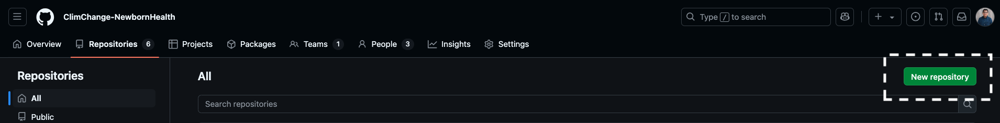
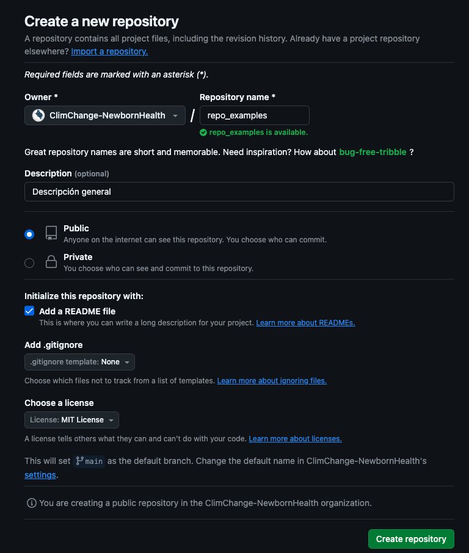
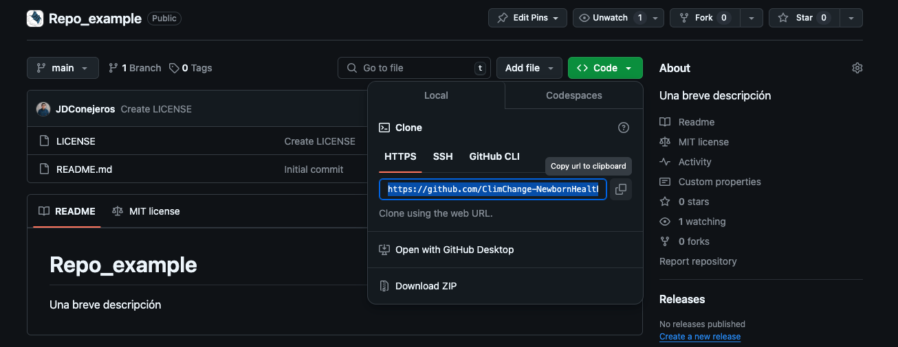
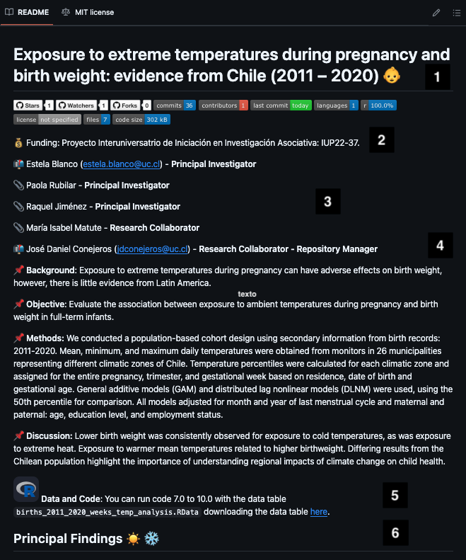
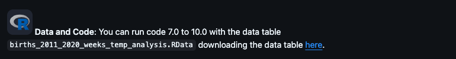
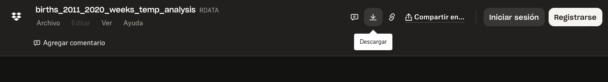

# Contributing (projects & manual)

This chapter mirrors [Lineamientos para colaboradores](https://github.com/ClimChange-NewbornHealth/Lineamientos_colaboradores); figures are reproduced from that repo inside this manual.

::: {.callout-important}
## Before publishing on GitHub
Do **not** upload identifiable data or secrets. Heavy tables stay **outside** GitHub (e.g. Dropbox, Google Drive) and are linked in the `README`.
:::

## Creating repositories

### Step 1 — create the repo



### Step 2 — configure metadata & base files



Repositories in the **EB-Lab** ecosystem under [ClimChange-NewbornHealth](https://github.com/ClimChange-NewbornHealth) should have:

- **Short** names, ideally **English**.
- A concise **description**.
- **Public** visibility (unless a documented exception).
- **`README.md`**, **`.gitignore`**, **license** (MIT recommended).

### Step 3 — clone locally



Use RStudio, VS Code, Positron, or any IDE that respects `git` + relative paths.

::: {.callout-tip}
## Small PRs
Prefer short branches & reviewed PRs before merging to `main`, especially for `Models/` and final artifacts.
:::

## Expected folder layout

```
Code/
  Process/
  Descriptive/
  Models/
Output_Analysis/
  Graphs/
  Tables/
.gitignore
README.md
LICENSE
```

## README content



1. Title (ideally manuscript title).
2. Metrics & funding (see template).
3. Authors incl. emails + repo maintainer.
4. Scientific description from the abstract where possible.
5. Data access links + ordered script execution.
6. Key results — numbered figures/tables with notes.

Template: [Plantilla_README.md](https://github.com/ClimChange-NewbornHealth/Lineamientos_colaboradores/blob/main/Plantilla_README.md).

## Data stays off-repo

Repos hold **code to replicate**; **large tables** are linked externally.

::: {.callout-warning}
## Storage & privacy
Uploading entire bases bloats the repo and increases disclosure risk. Keep access-controlled storage **outside** public `git`.
:::





Example README + external data workflow: [CIIIA-ClimateBirthWeightAnalysis](https://github.com/ClimChange-NewbornHealth/CIIIA-ClimateBirthWeightAnalysis).

## Contributing to **this** manual

1. Fork or obtain write access to [`eblab-manual`](https://github.com/ClimChange-NewbornHealth/eblab-manual).
2. Edit `.qmd` files / `_quarto.yml` as needed.
3. Maintain **Spanish + English**: run renders for both locales before PRs (`quarto render` + `cd english && quarto render`).
4. Open a **pull request** explaining the change.

Repository access questions: **jdconejeros\@uc.cl** (*Research collaborator – Repository manager*).
